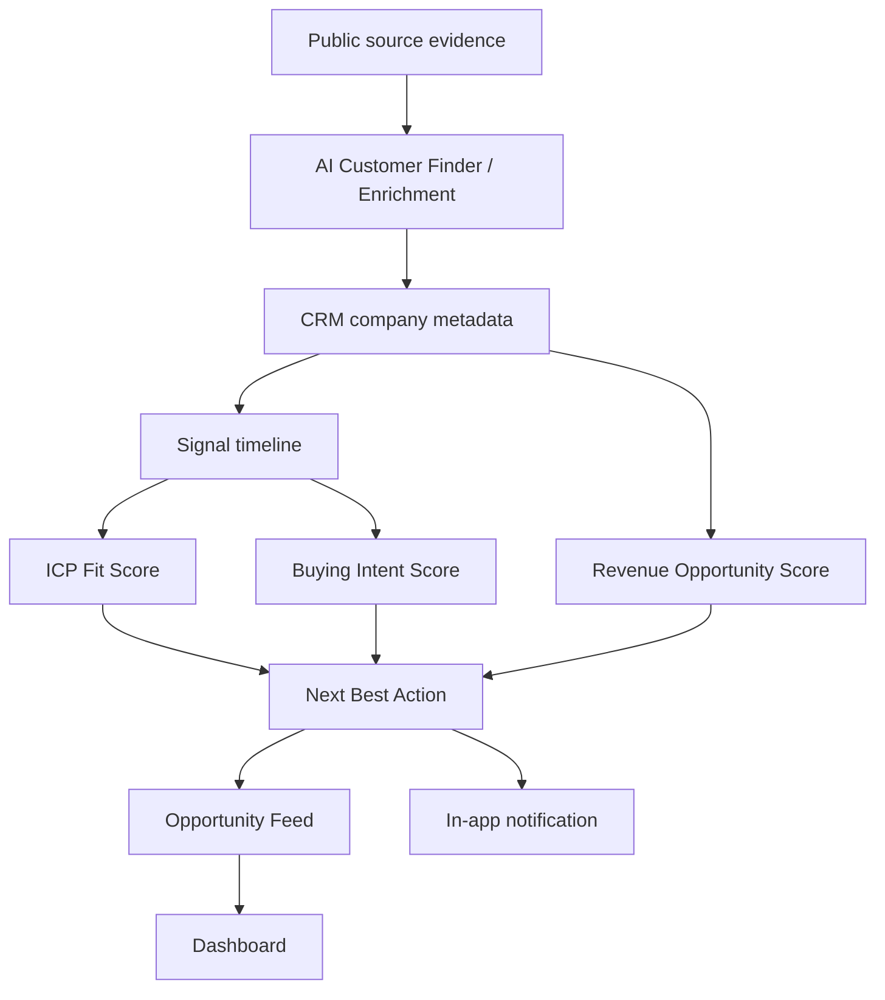

# AI Revenue Intelligence Engine

## Scope

AI Revenue Intelligence extends the existing Intent Signals and AI Customer Finder flow. It does not create a parallel CRM. It reads saved CRM companies, verified public signals, AI Customer Finder evidence, enrichment metadata, campaign/inbox state, and company timeline data, then produces a decision-first sales read model.

## Data Model

No new physical table is required for the MVP. The engine stores a derived snapshot in:

- `companies.metadata_json.ai_revenue_intelligence`
- `companies.metadata_json.ai_live_buying_signals`
- `companies.metadata_json.ai_watchlist`

Existing tables remain the source of truth:

- `companies`
- `leads`
- `contacts`
- `deals`
- `notifications`
- `audit_logs`
- `ai_customer_finder_results`
- `ai_customer_finder_sources`

## API

`GET /api/workspace-app/revenue-intelligence`

Returns:

- Opportunity Feed categories
- Top Opportunities
- Highest Intent Increase
- Recently Changed
- Watchlist Updates
- Recommended Today
- Intent Trend
- Pipeline Health

`POST /api/workspace-app/revenue-intelligence/companies/{company_id}/watchlist`

Body:

```json
{ "watchlisted": true }
```

Returns the company-level Revenue Intelligence snapshot.

## Scoring

The engine keeps three explainable scores:

### ICP Fit

- Industry
- Size
- Country
- Technology
- Use Case
- Disqualifiers

### Buying Intent

- Pain
- Hiring
- Funding
- Recency
- Evidence

### Revenue Opportunity

- Company Size
- Expansion
- Technology
- Decision Complexity
- Purchase Probability

Each score stores:

- final score
- factors
- weights
- explanation

## Signal Timeline

Company signal history is stored in `ai_live_buying_signals.change_timeline`.

Each event contains:

- timestamp
- signal type
- category
- source URL when available
- evidence summary
- previous score
- current score
- score delta
- confidence

## Next Best Action

The deterministic recommendation engine returns one of:

- Contact now
- Wait
- Monitor
- Research more
- Low priority

The recommendation includes:

- reason
- supporting signals
- blockers
- confidence
- recommended timing

`Contact now` is not allowed from ICP Fit alone. It requires a meaningful buying signal, enough confidence, and no major blocker. Outreach is never sent automatically.

## Multi-source Verification

Confidence improves when evidence is backed by multiple independent public source URLs.

The engine stores:

- verification count
- source diversity
- verification level

Levels:

- `none`
- `single_source`
- `multi_source`
- `strong`

## Watchlist

Users can add a company to the AI Watchlist. The existing continuous company monitoring worker already checks company changes; when fresh signals appear, it rebuilds the Revenue Intelligence snapshot and may create an in-app notification.

## Notifications

The system creates in-app notifications when:

- buying intent increases materially;
- a strong first signal appears;
- monitoring produces a high-confidence “Contact now” recommendation.

Emails and campaigns are never started automatically.

Notification spam protection:

- repeated same-company alerts use a 24-hour cooldown;
- unknown or rejected signal changes do not create notifications;
- minor score changes update history and the Opportunity Feed without interrupting the user.

## Pipeline



## Rollback

Rollback is safe because no production schema migration is required. Remove the `revenue_intelligence` API router and ignore `ai_revenue_intelligence` metadata snapshots. Existing CRM, Customer Finder, and enrichment data remain intact.
