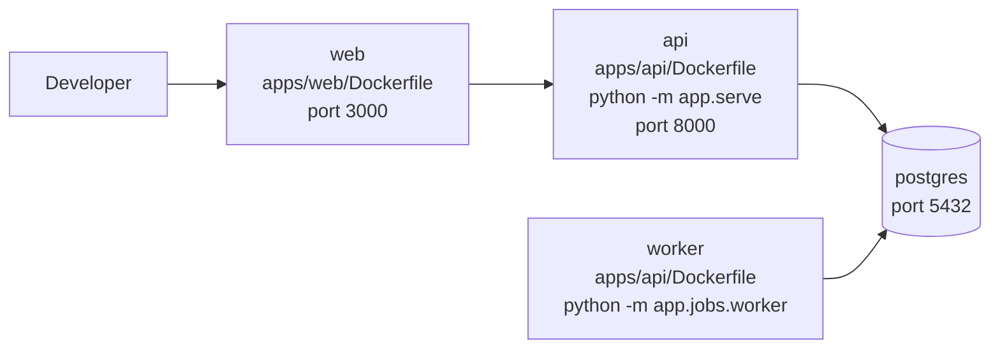
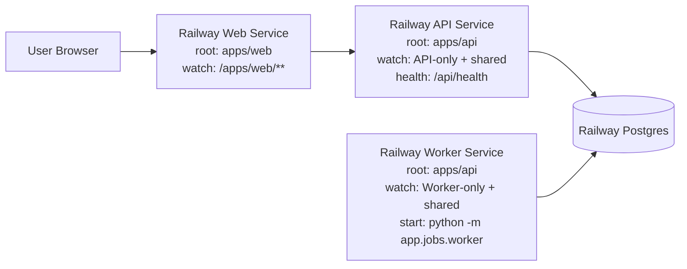

# Deployment Guide

## Production Architecture

OutreachAI production is split across three Railway services and one PostgreSQL service:

- API service
   - Root directory: `apps/api`
   - Config-as-code file: `/apps/api/railway.toml`
   - Start command: `python -m app.serve`
   - Healthcheck: `/api/health`
   - Watch paths: API-only + shared backend paths
- Worker service
   - Root directory: `apps/api`
   - Config-as-code file: `/apps/api/railway.worker.toml`
   - Start command: `python -m app.jobs.worker`
   - Healthcheck: none (worker is non-HTTP)
   - Watch paths: Worker-only + shared backend paths
- Web service
   - Root directory: `apps/web`
   - Config-as-code file: `/apps/web/railway.toml`
   - Start command: Dockerfile CMD (`npm start -- -H 0.0.0.0 -p ${PORT:-3000}`)
   - Healthcheck: `/api/health`
   - Watch paths: `/apps/web/**`

## Railway Setup

1. Create PostgreSQL on Railway.
2. Create API service:
    - Root Directory: `apps/api`
    - Config file path: `/apps/api/railway.toml`
3. Create Worker service:
    - Root Directory: `apps/api`
    - Config file path: `/apps/api/railway.worker.toml`
4. Create Web service:
    - Root Directory: `apps/web`
    - Config file path: `/apps/web/railway.toml`
5. Ensure branch is `main` for all production services.
6. Add required service variables (database, auth, billing, mail, provider keys).
7. Run `db/schema.sql` against the production database.

## Deployment Isolation Verification

Expected behavior after current configuration:

- Changing files only under `apps/web/**` should deploy only Web.
- Changing API-only files should deploy only API.
- Changing Worker-only files should deploy only Worker.
- Changing shared backend modules should deploy both API and Worker.
- Web should not deploy on backend-only changes.

Notes:

- API-only paths are watched only by API service (example: `app/main.py`, `app/serve.py`, `app/api/webhooks.py`).
- Worker-only path is watched only by Worker service (`app/jobs/**`).
- Shared paths are watched by both because Worker imports API workspace internals through `app.api.usage` and `app.api.routes`.

## Deployment Matrix

| Service | Root Directory | Config File | Start Command | Healthcheck |
|---|---|---|---|---|
| API | `apps/api` | `/apps/api/railway.toml` | `python -m app.serve` | `/api/health` |
| Worker | `apps/api` | `/apps/api/railway.worker.toml` | `python -m app.jobs.worker` | none |
| Web | `apps/web` | `/apps/web/railway.toml` | `npm start -- -H 0.0.0.0 -p ${PORT:-3000}` | `/api/health` |

## Trigger Matrix

| Changed Path | API Deploy | Worker Deploy | Web Deploy |
|---|---|---|---|
| `apps/api/app/main.py` | yes | no | no |
| `apps/api/app/serve.py` | yes | no | no |
| `apps/api/app/api/webhooks.py` | yes | no | no |
| `apps/api/app/jobs/**` | no | yes | no |
| `apps/api/app/api/usage.py` | yes | yes | no |
| `apps/api/app/api/routes.py` | yes | yes | no |
| `apps/api/app/core/**` | yes | yes | no |
| `apps/api/app/models/**` | yes | yes | no |
| `apps/api/app/schemas/**` | yes | yes | no |
| `apps/api/app/services/**` | yes | yes | no |
| `apps/web/**` | no | no | yes |
| other paths | no (unless manually deployed) | no (unless manually deployed) | no (unless manually deployed) |

## Local Architecture Diagram



## Production Architecture Diagram



## Stripe

1. Create Starter, Pro, and Agency monthly products.
2. Copy price IDs into `STRIPE_PRICE_STARTER`, `STRIPE_PRICE_PRO`, `STRIPE_PRICE_AGENCY`.
3. Configure webhook URL: `https://<api-domain>/webhooks/stripe`.
4. Subscribe to `checkout.session.completed`, `customer.subscription.updated`, `customer.subscription.deleted`, and `invoice.payment_succeeded`.

## Resend

1. Verify a sending domain.
2. Add SPF, DKIM, and DMARC DNS records.
3. Set `RESEND_FROM_EMAIL` to a verified sender.
4. Configure the Resend webhook endpoint:
   `https://outreachai-api-production.up.railway.app/webhooks/resend`
5. Subscribe to:
   `email.delivered`, `email.opened`, `email.bounced`, `email.complained`, and `email.received`.
6. Copy the Resend webhook signing secret into `RESEND_WEBHOOK_SECRET`.

Required Railway variables for the API service:

```env
RESEND_API_KEY=...
RESEND_FROM_EMAIL=...
RESEND_REPLY_TO=...
RESEND_WEBHOOK_SECRET=...
```

## Clerk

1. Enable email/password login.
2. Enable Google OAuth.
3. Configure allowed redirect URLs for Vercel domains.
4. Set JWT issuer and frontend publishable key.

## Production Infrastructure Release Checklist

Use this checklist before approving a production deployment. Do not mark the release ready until every item is verified from production runtime or the provider dashboard.

### Database Backups

- Provider: Railway managed PostgreSQL backups, or the external `pg_dump` backup service defined by `apps/api/railway.backup.toml`.
- Schedule: daily at 02:00 UTC minimum.
- Retention: at least 30 days and at least 30 retained successful backups.
- Restore: verify one restore into a staging/sandbox database before enabling the production readiness flag.
- Runtime gate: `GET https://outreachai-api-production.up.railway.app/api/ready` must return `database_backups_configured=true`.

Required Railway production variables for the API service and backup cron service:

```env
DATABASE_BACKUPS_ENABLED=true
BACKUP_PROVIDER=aws_s3|cloudflare_r2|backblaze_b2|gcs
BACKUP_BUCKET=...
BACKUP_PREFIX=outreachai/postgres
BACKUP_RETENTION_DAYS=30
BACKUP_RETENTION_COUNT=30
BACKUP_RESTORE_TEST_DATABASE_URL=...
AWS_ACCESS_KEY_ID=...
AWS_SECRET_ACCESS_KEY=...
AWS_REGION=...
S3_ENDPOINT_URL=...
GOOGLE_APPLICATION_CREDENTIALS=...
```

Only set provider-specific credentials required for the chosen provider. Keep `DATABASE_BACKUPS_ENABLED=false` until a backup run succeeds and restore verification passes.

### CSP Deployment

- Deploy the web commit that includes the production `Content-Security-Policy` header.
- Verify production headers on `https://outreachaiaiai.com/`:
  - `Content-Security-Policy`
  - `Strict-Transport-Security`
  - `X-Content-Type-Options`
  - `Referrer-Policy`
  - `Permissions-Policy`
  - `X-Frame-Options`
- Confirm Clerk sign-in loads.
- Confirm Stripe checkout and billing routes are not blocked.
- Confirm Google Fonts, Vercel assets, PostHog and LogRocket remain allowed only through approved domains.

### Production Deployment

- Confirm branch and commit SHA before deployment.
- Confirm Vercel project and production domain are correct.
- Confirm Railway project is `respectful-presence` and environment is `production`.
- Confirm Railway services are online:
  - `@outreachai/web`
  - `outreachai-api`
  - `outreachai-enrichment-worker`
  - `Postgres`
- Run production health checks:
  - Web `/api/health`
  - API `/api/health`
  - API `/api/live`
  - API `/api/ready`
- Verify sign-in, dashboard, companies, campaigns, inbox, billing, settings and profile.
- Check browser console and network for 4xx/5xx or CSP violations.

### Rollback

- Vercel: promote the previous successful production deployment back to the production alias.
- Railway API: redeploy the previous stable deployment or revert with a new Git commit and redeploy.
- Railway worker: redeploy the previous stable worker deployment if the worker is impacted.
- Database: restore only from a verified backup after incident approval.
- After rollback, rerun web/API health checks and the authenticated smoke path.
